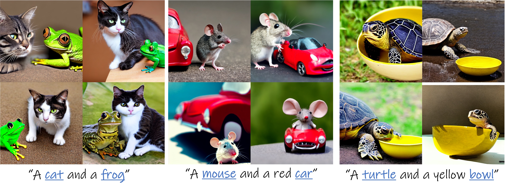

# Attend-and-Excite: Attention-Based Semantic Guidance for Text-to-Image Diffusion Models (SIGGRAPH 2023)

> Hila Chefer*, Yuval Alaluf*, Yael Vinker, Lior Wolf, Daniel Cohen-Or  
> Tel Aviv University  
> \* Denotes equal contribution  
>
> Recent text-to-image generative models have demonstrated an unparalleled ability to generate diverse and creative imagery guided by a target text prompt. While revolutionary, current state-of-the-art diffusion models may still fail in generating images that fully convey the semantics in the given text prompt. We analyze the publicly available Stable Diffusion model and assess the existence of catastrophic neglect, where the model fails to generate one or more of the subjects from the input prompt. Moreover, we find that in some cases the model also fails to correctly bind attributes (e.g., colors) to their corresponding subjects. To help mitigate these failure cases, we introduce the concept of Generative Semantic Nursing (GSN), where we seek to intervene in the generative process on the fly during inference time to improve the faithfulness of the generated images. Using an attention-based formulation of GSN, dubbed Attend-and-Excite, we guide the model to refine the cross-attention units to attend to all subject tokens in the text prompt and strengthen — or excite — their activations, encouraging the model to generate all subjects described in the text prompt. We compare our approach to alternative approaches and demonstrate that it conveys the desired concepts more faithfully across a range of text prompts.

<a href="https://arxiv.org/abs/2301.13826"></a>
<a href="https://attendandexcite.github.io/Attend-and-Excite/"></a> 
<a href="https://youtu.be/9EWs2IX4cus"></a> 
[](https://huggingface.co/spaces/hysts/Attend-and-Excite)
[](https://replicate.com/daanelson/attend-and-excite)

<p align="center">
  
<br>
Given a pre-trained text-to-image diffusion model (e.g., Stable Diffusion) our method, Attend-and-Excite, guides the generative model to modify the cross-attention values during the image synthesis process to generate images that more faithfully depict the input text prompt. Stable Diffusion alone (top row) struggles to generate multiple objects (e.g., a horse and a dog). However, by incorporating Attend-and-Excite (bottom row) to strengthen the subject tokens (marked in blue), we achieve images that are more semantically faithful with respect to the input text prompts. 
</p>

## Description  
Official implementation of our Attend-and-Excite paper.

## Setup

### Environment
Our code builds on the requirement of the official [Stable Diffusion repository](https://github.com/CompVis/stable-diffusion). To set up their environment, please run:

```
conda env create -f environment/environment.yaml
conda activate ldm
```

On top of these requirements, we add several requirements which can be found in `environment/requirements.txt`. These requirements will be installed in the above command.

### Hugging Face Diffusers Library
Our code relies also on Hugging Face's [diffusers](https://github.com/huggingface/diffusers) library for downloading the Stable Diffusion v1.4 model. 


## Usage

<p align="center">
  
<br>
Example generations outputted by Stable Diffusion with Attend-and-Excite. 
</p>

To generate an image, you can simply run the `run.py` script. For example,
```
python run.py --prompt "a cat and a dog" --seeds [0] --token_indices [2,5]
```
Notes:

- To apply Attend-and-Excite on Stable Diffusion 2.1, specify: `--sd_2_1 True`
- You may run multiple seeds by passing a list of seeds. For example, `--seeds [0,1,2,3]`.
- If you do not provide a list of which token indices to alter using `--token_indices`, we will split the text according to the Stable Diffusion's tokenizer and display the index of each token. You will then be able to input which indices you wish to alter.
- If you wish to run the standard Stable Diffusion model without Attend-and-Excite, you can do so by passing `--run_standard_sd True`.
- All parameters are defined in `config.py` and are set to their defaults according to the official paper.

All generated images will be saved to the path `"{config.output_path}/{prompt}"`. We will also save a grid of all images (in the case of multiple seeds) under `config.output_path`.

### Float16 Precision
When loading the Stable Diffusion model, you can use `torch.float16` in order to use less memory and attain faster inference:
```python
stable = AttendAndExcitePipeline.from_pretrained("CompVis/stable-diffusion-v1-4", torch_dtype=torch.float16).to(device)
```
Note that this may result in a slight degradation of results in some cases. 

## Notebooks 
We provide Jupyter notebooks to reproduce the results from the paper for image generation and explainability via the 
cross-attention maps.

<p align="center">
  
<br>
Example cross-attention visualizations. 
</p>

### Generation
`notebooks/generate_images.ipynb` enables image generation using a free-form text prompt with and without Attend-and-Excite.

### Explainability
`notebooks/explain.ipynb` produces a comparison of the cross-attention maps before and after applying Attend-and-Excite 
as seen in the illustration above.
This notebook can be used to provide an explanation for the generations produced by Attend-and-Excite.

## Metrics 
In `metrics/` we provide code needed to reproduce the quantitative experiments presented in the paper: 
1. In `compute_clip_similarity.py`, we provide the code needed for computing the image-based CLIP similarities. Here, we compute the CLIP-space similarities between the generated images and the guiding text prompt. 
2. In `blip_captioning_and_clip_similarity.py`, we provide the code needed for computing the text-based CLIP similarities. Here, we generate captions for each generated image using BLIP and compute the CLIP-space similarities between the generated captions and the guiding text prompt. 
    - Note: to run this script you need to install the `lavis` library. This can be done using `pip install lavis`.

To run the scripts, you simply need to pass the output directory containing the generated images. The direcory structure should be as follows:
```
outputs/
|-- prompt_1/
|   |-- 0.png 
|   |-- 1.png
|   |-- ...
|   |-- 64.png
|-- prompt_2/
|   |-- 0.png 
|   |-- 1.png
|   |-- ...
|   |-- 64.png
...
```
The scripts will iterate through all the prompt outputs provided in the root output directory and aggregate results across all images. 

The metrics will be saved to a `json` file under the path specified by `--metrics_save_path`. 

### Evaluation Prompts 
The prompts used in our quantitative evaluations can be found [here](https://github.com/AttendAndExcite/Attend-and-Excite/files/11336216/a.e_prompts.txt). 

## Acknowledgements 
This code is builds on the code from the [diffusers](https://github.com/huggingface/diffusers) library as well as the [Prompt-to-Prompt](https://github.com/google/prompt-to-prompt/) codebase.

## Citation
If you use this code for your research, please cite the following work: 
```
@misc{chefer2023attendandexcite,
      title={Attend-and-Excite: Attention-Based Semantic Guidance for Text-to-Image Diffusion Models}, 
      author={Hila Chefer and Yuval Alaluf and Yael Vinker and Lior Wolf and Daniel Cohen-Or},
      year={2023},
      eprint={2301.13826},
      archivePrefix={arXiv},
      primaryClass={cs.CV}
}
```
